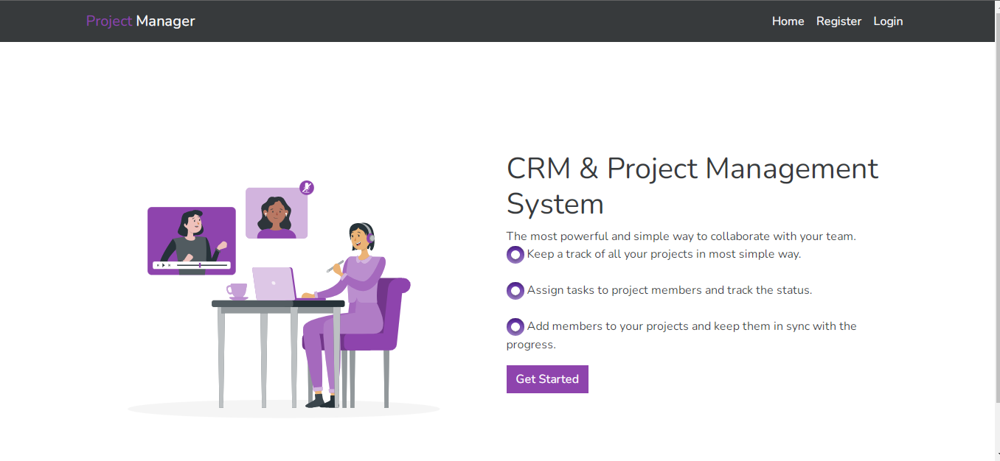
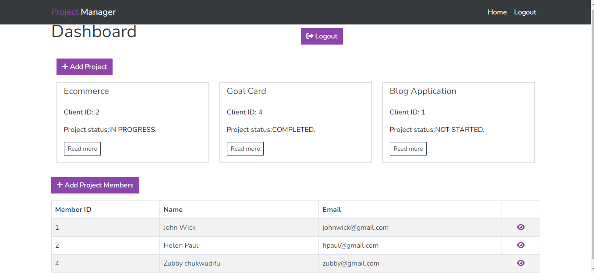

# Project Manager Website With Django + React
promanager is simple way to collaborate with your team, Keep a track of all your projects in most simple way.

Live Demo can be viewed at https://promanager.netlify.app/

 

# Features
* Full Crud fuctionality
* User Authentication with react-redux
* Restapi with djangorestframework

# Download & Setup Instructions

# Setup for Django

* 1 - Clone project: git clone https://github.com/patoski716/promanager-django.git
* 2 - cd promanager-django
* 3 - Create virtual environment: virtualenv myenv
* 4 - myenv\scripts\activate
* 5 - pip install -r requirements.txt
* 6 - python manage.py runserver

# Setup for react
* 1 - cd frontend
* 2 - npm install
